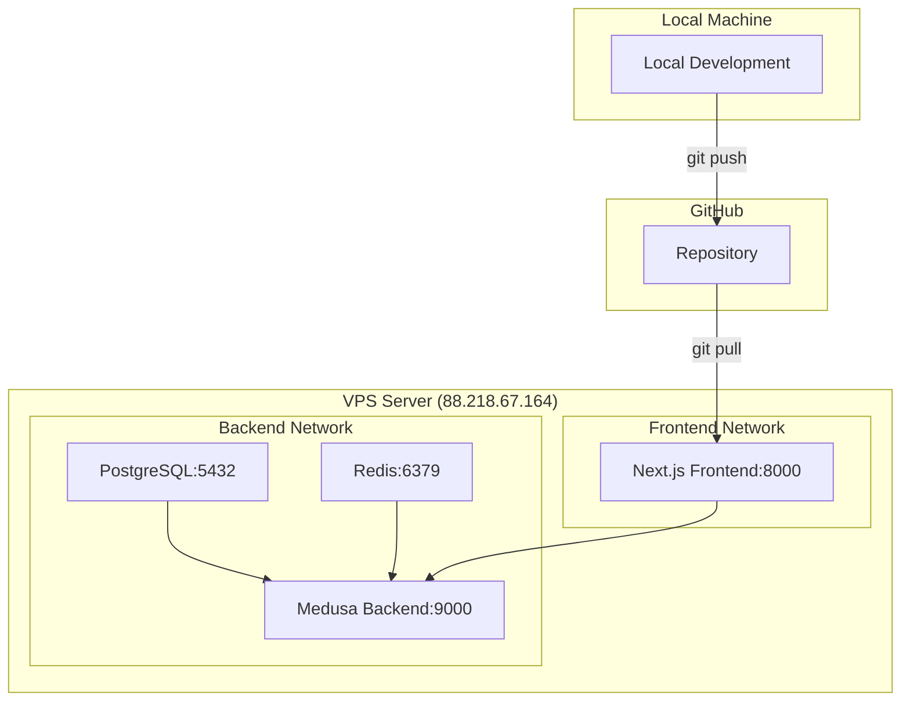
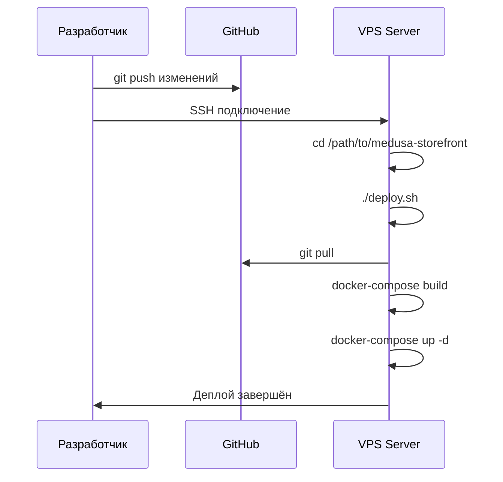

# План контейнеризации Medusa Frontend (Next.js)

## Обзор задачи

Подготовить проект `medusa-storefront` для работы в Docker контейнере с возможностью деплоя на VPS через GitHub.

## Конфигурация окружения

- **Frontend URL**: `http://88.218.67.164:8000`
- **Backend URL**: `http://88.218.67.164:9000`
- **Способ деплоя**: Ручной pull на VPS и запуск docker-compose
- **Организация контейнеров**: Отдельный docker-compose.yml в medusa-storefront

## Архитектура



## Задачи

### 1. Создать Dockerfile для Next.js frontend

**Файл**: `medusa-storefront/Dockerfile`

**Требования**:
- Использовать multi-stage build для оптимизации размера образа
- Stage 1: Dependencies - установка зависимостей
- Stage 2: Builder - сборка Next.js приложения
- Stage 3: Runner - production runtime
- Использовать Node.js 20 Alpine
- Копировать только необходимые файлы
- Установить переменные окружения для production
- Экспонировать порт 8000
- Запускать через `next start`

### 2. Создать .dockerignore

**Файл**: `medusa-storefront/.dockerignore`

**Требования**:
- Исключить `.next`, `node_modules`, `.git`
- Исключить локальные env файлы (`.env.local`, `.env.development.local`)
- Исключить файлы IDE (`.vscode`, `.idea`)
- Исключить тестовые файлы и документацию

### 3. Создать docker-compose.yml для frontend

**Файл**: `medusa-storefront/docker-compose.yml`

**Требования**:
- Сервис `frontend` с build из текущей директории
- Порт 8000:8000
- Переменные окружения из `.env.production`
- Restart policy: `unless-stopped`
- Health check для проверки работоспособности
- Отдельная сеть для связи с backend

### 4. Создать .env.production

**Файл**: `medusa-storefront/.env.production`

**Требования**:
- `MEDUSA_BACKEND_URL=http://88.218.67.164:9000`
- `NEXT_PUBLIC_BASE_URL=http://88.218.67.164:8000`
- `NEXT_PUBLIC_DEFAULT_REGION=eu`
- `NEXT_PUBLIC_MEDUSA_PUBLISHABLE_KEY=pk_9d289addad0dc23aafc8e3a6d5248186302ea7cbb613be70c75dd8e3587ba363`
- `REVALIDATE_SECRET=supersecret`
- `NODE_ENV=production`

### 5. Создать скрипт деплоя deploy.sh

**Файл**: `medusa-storefront/deploy.sh`

**Требования**:
- Проверка наличия .env.production
- Остановка существующих контейнеров
- Pull изменений из GitHub
- Сборка нового образа
- Запуск контейнеров
- Очистка старых образов
- Логирование процесса

### 6. Создать инструкцию по деплою DEPLOYMENT.md

**Файл**: `medusa-storefront/DEPLOYMENT.md`

**Требования**:
- Предварительные требования (Docker, Docker Compose, Git)
- Шаги настройки на VPS
- Команды для деплоя
- Команды для управления контейнерами
- Troubleshooting

### 7. Проверить и обновить CORS настройки в backend

**Файл**: `medusa-store/medusa-config.ts`

**Требования**:
- Добавить `http://88.218.67.164:8000` в CORS настройки
- Проверить store CORS для storefront

### 8. Создать README для контейнеризации

**Файл**: `medusa-storefront/DOCKER.md`

**Требования**:
- Краткое описание контейнеризации
- Локальный запуск через Docker
- Команды для разработки
- Ссылка на DEPLOYMENT.md

## Структура файлов после выполнения

```
medusa-storefront/
├── Dockerfile                    # Новый
├── .dockerignore                 # Новый
├── docker-compose.yml            # Новый
├── .env.production              # Новый
├── deploy.sh                     # Новый
├── DEPLOYMENT.md                 # Новый
├── DOCKER.md                     # Новый
├── .env.template                 # Существует
├── .env.local                    # Существует (локальный)
├── package.json                  # Существует
├── next.config.js                # Существует
└── ... (остальные файлы)
```

## Процесс деплоя на VPS



## Примечания

1. **Безопасность**: `.env.production` не должен коммититься в Git
2. **Health Check**: Контейнер должен проверять работоспособность приложения
3. **Логи**: Логи должны быть доступны через `docker-compose logs`
4. **Обновление**: При деплое старые контейнеры должны корректно останавливаться
5. **CORS**: Backend должен разрешать запросы с frontend URL

## Следующие шаги

После утверждения плана:
1. Переключиться в режим Code
2. Создать все необходимые файлы
3. Протестировать локально
4. Обновить CORS в backend
5. Создать документацию
